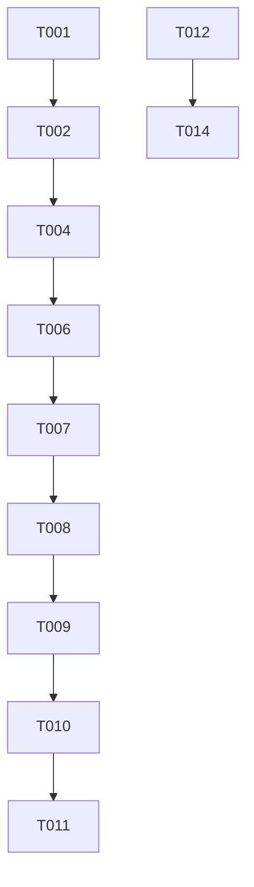

# Tasks: High Performance Modbus Driver

**Feature Branch**: `003-high-perf-modbus-driver`
**Implementation Strategy**: MVP first - implement the core async driver and connection pooling before integrating with the ScanManager.

## Phase 1: Setup

- [x] T001 Upgrade solution and projects to .NET 10.0 in ModbusPerfTest.sln
- [x] T002 Update backend project dependencies for compatibility in backend/ModbusPerfTest.Backend.csproj
- [x] T003 Add high-performance driver configuration flags in backend/appsettings.json

## Phase 2: Foundational

- [x] T004 [P] Update DeviceConfig and FrameConfig models to include Name properties in backend/src/Models/DeviceConfig.cs
- [x] T005 [P] Create IModbusDriver interface extensions if needed in backend/src/Services/IModbusDriver.cs

## Phase 3: [US1] Concurrent Multi-Frequency Polling

**Goal**: Implement the core async driver and verify independent polling.

- [x] T006 [P] [US1] Implement HighPerformanceModbusDriver with ConcurrentDictionary connection pooling in backend/src/Services/HighPerformanceModbusDriver.cs
- [x] T007 [P] [US1] Implement TCP optimizations (NoDelay, buffers) in HighPerformanceModbusDriver.cs
- [x] T008 [US1] Register HighPerformanceModbusDriver in dependency injection container in backend/Program.cs
- [x] T009 [US1] Update DeviceScanManager to utilize independent polling loops for each frame in backend/src/Services/DeviceScanManager.cs

## Phase 4: [US2] Automated Connection Recovery

**Goal**: Ensure driver handles connection drops gracefully without state corruption.

- [x] T010 [US1] Implement error handling and connection removal on failure in HighPerformanceModbusDriver.cs
- [x] T011 [US1] Verify reconnection logic by restarting Modbus simulator

## Phase 5: Polish & Configuration Utility

- [x] T012 [P] Create convert-device-config.ps1 script for XML to JSON transformation in root directory
- [x] T013 Create HIGH_PERFORMANCE_DRIVER.md detailed technical documentation
- [x] T014 [P] Update README.md with high-performance driver details and XML import instructions

## Dependency Graph

## Parallel Execution Examples

- **Setup & Foundational**: T001 and T004 can start in parallel.
- **Implementation**: T006 and T012 can be worked on simultaneously.

## Implementation Strategy

- **Increment 1**: Upgrade .NET and update models (Phase 1-2).
- **Increment 2**: Implementation of the async driver (Phase 3).
- **Increment 3**: Finalizing utility scripts and documentation (Phase 5).

