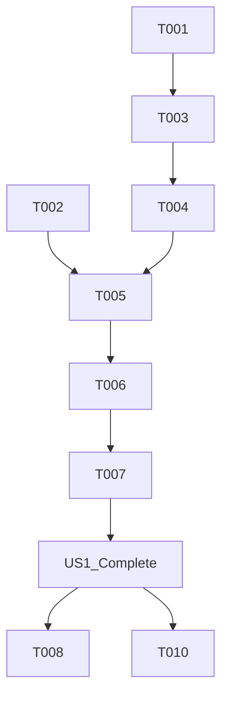

# Tasks: System Resource Metrics

**Input**: Design documents from `/specs/007-system-resource-metrics/`
**Prerequisites**: plan.md (required), spec.md (required)

**Organization**: Tasks are grouped by user story to enable independent implementation and testing of each story.

## Format: `[ID] [P?] [Story] Description`

- **[P]**: Can run in parallel (different files, no dependencies)
- **[Story]**: Which user story this task belongs to (e.g., US1, US2, US3)
- Include exact file paths in descriptions

## Phase 1: Setup

**Purpose**: Define data structures and interfaces

- [X] T001 Define `SystemResourceMetrics` model in `backend/src/Models/SystemResourceMetrics.cs`
- [X] T002 [P] Update resource metric interfaces in `frontend/src/types.ts`

---

## Phase 2: Foundational

**Purpose**: Implement backend sampling and API

- [X] T003 Implement `ResourceMonitorService` in `backend/src/Services/ResourceMonitorService.cs` using `Process.GetCurrentProcess()`
- [X] T004 Expose new performance metrics endpoint in `backend/src/Api/MetricsController.cs`

---

## Phase 3: User Story 1 - Real-Time Resource Monitoring (Priority: P1) 🎯 MVP

**Goal**: Display live CPU and Memory usage on the dashboard

**Independent Test**: Launch application and verify that CPU % and Memory MB are displayed and updating every 2 seconds on the main dashboard.

### Implementation for User Story 1

- [X] T005 [P] [US1] Update API client in `frontend/src/api.ts` to fetch resource metrics
- [X] T006 [US1] Implement display UI in `frontend/src/components/HealthMonitor.tsx` or `frontend/src/components/SystemHealthPanel.tsx`
- [X] T007 [US1] Add refresh logic to poll system metrics every 2 seconds in the frontend components

**Checkpoint**: User Story 1 complete - basic monitoring is functional.

---

## Phase 4: User Story 2 - Performance Bottleneck Identification (Priority: P2)

**Goal**: Correlate scanning activity with resource usage

**Independent Test**: Start a high-load scan (10k points) and observe the corresponding spike in CPU/Memory usage on the dashboard.

### Implementation for User Story 2

- [X] T008 [US2] Verify resource metrics update correctly alongside existing throughput metrics
- [X] T009 [US2] Ensure dashboard layout remains stable when resource values fluctuate significantly

---

## Phase 5: User Story 3 - Resource Leak Detection (Priority: P3)

**Goal**: Ensure long-term stability monitoring

**Independent Test**: Run a constant scan for 5+ minutes and verify memory usage (MB) does not monotonically increase.

### Implementation for User Story 3

- [X] T010 [US3] Add basic debug logging for resource metrics in `backend/src/Services/ResourceMonitorService.cs` to help track over time

---

## Phase 6: Polish & Cross-cutting Concerns

- [X] T011 [P] Format CPU percentage to 1 decimal place (e.g., 12.5%) in UI
- [X] T012 [P] Ensure memory units are explicitly labeled as "MB" in UI
- [X] T013 Verify error handling for when resource sampling fails (e.g., return 0 or N/A)

## Dependency Graph

## Parallel Execution Examples

- **Step 1**: T001 (Backend Model) and T002 (Frontend Types) can be done in parallel.
- **Step 2**: T003 (Backend Service) and T005 (Frontend API Client) can be worked on once models are defined.
- **Step 3**: T011, T012 (Formatting) can be done while integrating US1.

## Implementation Strategy

- **MVP First**: Focus on Phase 1-3 to get the data flowing to the UI.
- **Incremental**: Use standard .NET APIs for resource measurement to keep it simple and portable.
